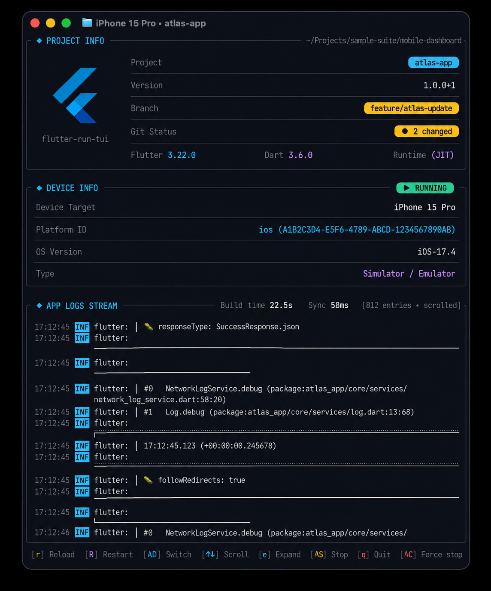
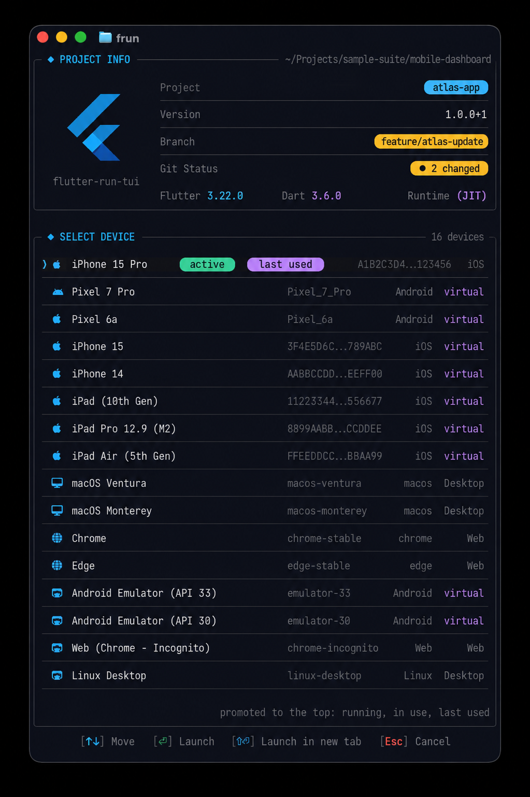
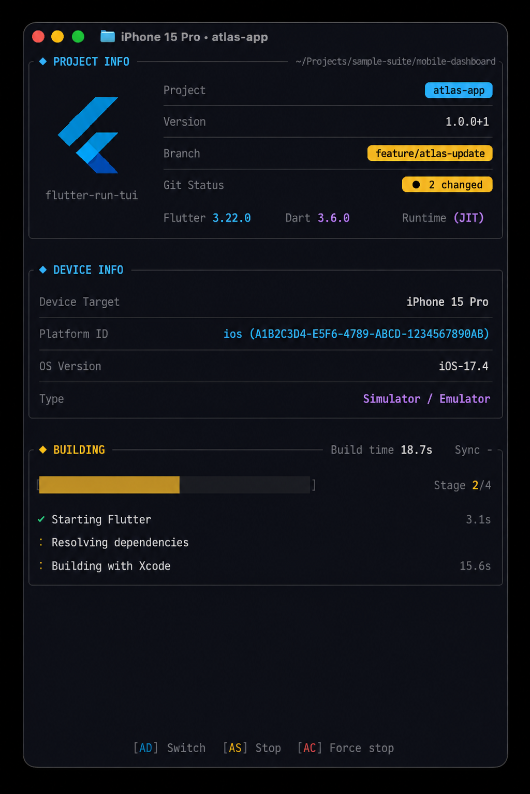
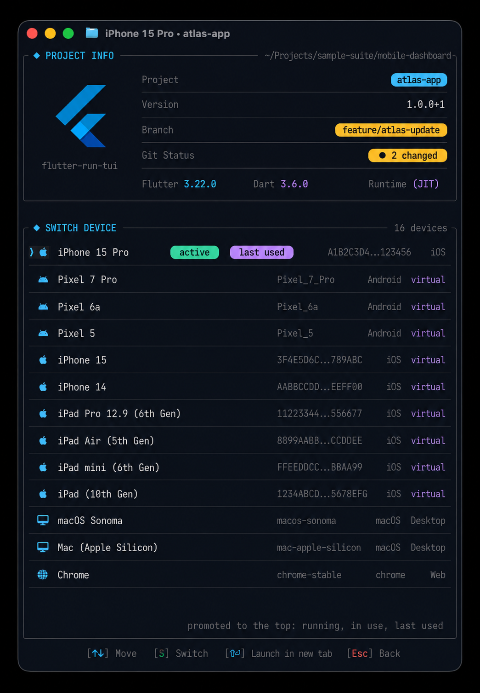
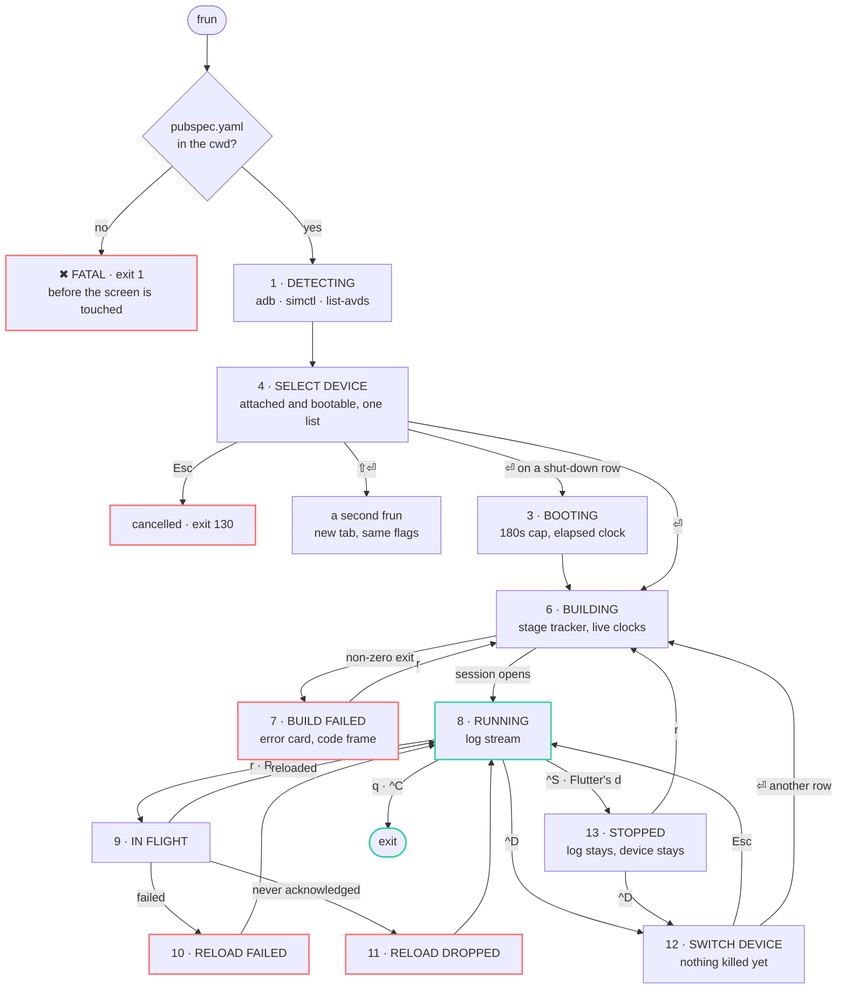

<div align="center">
  

  # flutter-run-tui

  *A terminal UI for `fvm flutter run` — device picker, build stages and app logs in one frame*

  
  
  
  

  [Features](#features) • [Requirements](#requirements) • [Install](#install) • [Usage](#usage) • [Keyboard](#keyboard) • [Screens](#screens) • [Development](#development)
</div>

`flutter run` prints a scrolling wall of text: the device you picked, the stage it is on, the timings, and your app's own logs all compete for the same rows, and the useful part is whatever happened to scroll last. **frun** puts each of those in a place that stays put — a project card, a device card, a build phase tracker with live per-stage clocks, and a scrollable log window — and drives Flutter through a pty so every interactive key it has still works.

<div align="center">
  
  <br>
  <sub>A live run on an iPhone 17 Pro Max simulator. The tab titles itself, the build totals sit in the log card's title bar, and the footer is the cheatsheet.</sub>
</div>

## Features

- **A picker that opens in under half a second.** `adb`, `emulator -list-avds` and `simctl` answer the same question in ~200ms that `fvm flutter devices --machine` answers in 6-9s. The list opens on theirs; Flutter's lands behind it as a refresh and fills in the rows only it knows about (macOS, Chrome, physical iPhones).
- **One merged device list.** Running devices and bootable targets in a single list, ordered by what is running, what another `flutter run` is already using, and what you used last. `active`, `in use`, `last used` and `running` are per-row chips, re-earned every 4 seconds while the list is on screen.
- **Boot from the picker.** A shut-down simulator or AVD is a row you can press `Enter` on: `simctl bootstatus -b` for iOS, `sys.boot_completed` polling for Android with a 180s cap, an elapsed clock while it happens, then straight into the build.
- **Build stages with honest timings.** Rows are opened by what Flutter actually prints, per platform, and one row is always spinning: a row is closed by its successor arriving, at the same instant it is charged. Settled numbers never move afterwards.
- **A build failure you can read.** Exit code, which stage broke, and the code frame pulled from disk around the `file.dart:line:col` Dart reported — one line either side. `r` kills, reaps and respawns, keeping the previous log so the two runs can be compared.
- **Hot reload that tells the truth.** Flutter drops keypresses while it is busy and says so only through a trace that never reaches stdout, so an unacknowledged `r` resolves as *dropped — press r again* instead of spinning forever.
- **Switch device without leaving.** `^D` reopens the list over the live run, `Esc` costs nothing, and picking another row kills, reaps, shuts the outgoing virtual device down and rebuilds in the same terminal.
- **Two devices, two tabs.** `⇧Enter` hands the chosen row to a second `frun` in a new Ghostty or tmux tab, with your `--flavor`/`--dart-define` flags and a working `PATH`, so it starts building without repeating discovery. Each tab names itself `<device> · <project>`.
- **Stop without leaving.** `^S` ends the run and keeps the frame; `r` builds again, bringing the device back up first if it has since shut down. Flutter's own `d` (detach) lands in the same frame instead of closing frun.
- **A log window that is treated as the point.** Wrapped at word boundaries with continuation rows indented to the message column, scrollable with the arrows, `j`/`k` and the wheel, `e` to give it the whole frame, and replayed as a plain transcript into your scrollback on exit.
- **Layout that degrades in a stated order.** The log window is a floor, not leftovers; the cards give up separators, then row spacing, then themselves. Nothing is drawn below `60x14`.
- **Every key it does not claim is forwarded verbatim.** `h`, `c`, `p`, `o`, `w`, `d` and the rest reach Flutter unchanged, which is why the new verbs are `^D`, `^S` and `⇧Enter` rather than letters.

## Requirements

| | |
| :--- | :--- |
| **Rust** | stable toolchain, 2021 edition |
| **FVM** | `fvm` on `PATH` — every Flutter call goes through it (`fvm flutter run`) |
| **Android** | `adb` and `emulator` for phones and AVDs |
| **iOS** | Xcode command line tools for `xcrun simctl` |
| **Font** | A Nerd Font (JetBrains Mono Nerd Font, Fira Code Nerd Font). Platform glyphs and pill caps are Nerd Font code points, chosen because emoji are double-width and break the column grid |
| **Terminal** | Any. Ghostty is what it is developed against: the logo uses the kitty graphics protocol where available and falls back to halfblocks, and `⇧Enter` needs the kitty keyboard protocol |

> [!NOTE]
> macOS is the tested platform. `xcrun`, `pgrep` and the Ghostty AppleScript path are macOS-only; the Android half and the tmux new-tab path are not.

## Install

```bash
git clone https://github.com/okasutarto/flutter-run-tui.git ~/.config/zsh/flutter-run-tui
cd ~/.config/zsh/flutter-run-tui
cargo build --release
```

The binary is `target/release/frun-tui`. It changes no shell state, so a symlink on `PATH` is enough:

```bash
ln -s "$PWD/target/release/frun-tui" ~/.local/bin/frun
```

A zsh function works just as well, and is how it is wired up here — it can print a build hint when the binary is missing:

```zsh
# ~/.zshrc
frun() {
  local bin="$HOME/.config/zsh/flutter-run-tui/target/release/frun-tui"
  [[ -x $bin ]] || { print -u2 "frun: not built yet"; return 127 }
  "$bin" "$@"
}
```

## Usage

Run it from a Flutter project directory. Anything you pass is forwarded to Flutter:

```bash
frun                                    # pick a device, build, run
frun --flavor staging                   # forwarded, and carried into a ⇧Enter tab
frun --dart-define=API=http://localhost:8080
```

> [!IMPORTANT]
> `pubspec.yaml` must exist in the working directory. That check happens before the terminal is touched, so the failure is a line in your scrollback rather than a frame in an alternate screen.

Exit codes are part of the interface, so a script wrapping `frun` can tell the cases apart:

| Code | Meaning |
| ---: | :--- |
| `0` | normal exit, or a graceful `q` / `^S` |
| `1` | fatal — no `pubspec.yaml`, discovery failed, a boot never finished |
| `130` | the pick was cancelled with `Esc` |
| *Flutter's own* | the build failed |

### Environment

| Variable | Effect |
| :--- | :--- |
| `FRUN_NO_QUERY` | Skips the two terminal capability queries. Use it when the logo probe or the keyboard-protocol probe hangs (a bare pty, some task runners): both wait on a reply from stdin, and a terminal that never answers costs 2s each and can leave stdin unreadable. The logo falls back to halfblocks and `⇧Enter` is left working but unadvertised |
| `FRUN_DEVICE` | The handoff a `⇧Enter` tab is started with: one tab-separated device row. Set by frun, not by hand |
| `FVM_CACHE_PATH` | Honoured when resolving the pinned SDK, and passed to a new tab so both resolve the same one |
| `TMUX` | When set, `⇧Enter` uses `tmux new-window`; otherwise Ghostty via `osascript` |

> [!TIP]
> Mouse capture is **off** by default, so text selection still belongs to the terminal and copying a stack trace out of the log window keeps working. `m` turns it on when you want the wheel or clickable rows.

## Keyboard

The footer is the cheatsheet and it adapts to the state, so a key is only advertised where it does something. Under about 100 columns it drops the words and keeps every keycap.

| Key | Action | Where |
| :--- | :--- | :--- |
| `↑` `↓` | Move the selection | any list |
| `1`-`9` | Pick the nth row | any list |
| `Enter` | Launch, switch, or keep the row already running | any list |
| `⇧Enter` | Launch the row in a new terminal tab | any list, kitty keyboard protocol only |
| `Esc` | Cancel and exit `130`, or go back to the run when the list was opened over one | discovery, switch |
| `r` | Hot reload · retry a failed build · build again after a stop | run · `BUILD_FAILED` · `STOPPED` |
| `R` | Hot restart | during a run |
| `↑` `↓` `j` `k` | Scroll the log window | wherever a log window is on screen |
| `e` | Give the log window the whole frame, and back | wherever a log window is on screen |
| `^D` | Switch device over the live run | build, run, stopped |
| `^S` | Stop the run, stay in frun | build, run |
| `q` | Quit gracefully — Flutter shuts itself down | build, run |
| `^C` | Force stop — SIGINT forwarded, frun exits | any |
| `m` | Toggle mouse capture | global |
| *anything else* | Forwarded to Flutter untouched — including `h`, `d`, `c`, `p`, `o`, `w` | during a run |

## Screens

Captures of a real session — Ghostty, JetBrains Mono Nerd Font, one Flutter project, one simulator. The Flutter mark is a real image through the terminal's graphics protocol, and falls back to halfblocks where there isn't one.

### Pick a device



Sixteen devices in one list, opened on the fast path rather than waiting on Flutter's own scan. The simulator at the top carries `active` — it is booted and can run now — and `last used`, which is why it is first. Everything below it is offered in the same list whether it is attached, installed and shut down, or a desktop and web target, and `Enter` boots what needs booting before it builds.

### Build



`Starting Flutter` closed at 4.6s and `Building with Xcode` is spinning at 17.6s, with `Stage 2/4` and the bar keyed to the platform's own count. `Starting Flutter` is frun's own row: it covers `fvm` resolving the SDK, the Dart VM booting and flutter_tools starting, which is 3-8s that Flutter announces nowhere. `Sync -` because nothing has been reloaded yet.

### Switch device



`^D` reopens the same list over the session, retitled, with `Esc` meaning back rather than cancel — nothing is killed until another row is picked. Captured after a run had ended, so no row claims ` running `: that chip and its ` ⏎ Keep ` badge are only true while a session is live, and a list that showed them here would be offering to keep something that is already gone.

> [!WARNING]
> Switching away from a **virtual** device shuts it down — `simctl shutdown` or `adb emu kill` — including one you had open for something else. Physical devices, macOS and Chrome are untouched.

### Every frame

Twelve of them, each with a slug the harness can render on demand without a device attached. `frun-tui --all` walks every one; `--demo` does the same on a timer, in a live terminal, which is how the states that are awkward to provoke get looked at.

| # | Slug | Frame |
| ---: | :--- | :--- |
| 1 | `detecting` | discovery running, spinner and the command behind it |
| 3 | `booting` | booting a simulator or AVD, with an elapsed clock |
| 4 | `picker` | `SELECT DEVICE` — running devices and bootable targets, merged |
| 5 | `single` | one device, no picker (superseded, kept as a render target) |
| 6 | `building` | the stage tracker, live clocks, `Stage n/m` |
| 7 | `build-failed` | compiler error, exit code, code frame, which stage broke |
| 8 | `running` | log stream, hot reload results inline |
| 9 | `reload` | reload or restart in flight |
| 10 | `reload-failed` | Flutter accepted the key and the operation failed |
| 11 | `reload-dropped` | Flutter never acknowledged the key at all |
| 12 | `switch` | `SWITCH DEVICE` — the list reopened over a live run |
| 13 | `stopped` | the run is over, frun is not |

<details>
<summary><b>Build failure</b> — <code>frun-tui --dump build-failed 96x22</code></summary>

```text
cwclub 2.1.0+32  refactor/cwclub-new  ✔ clean                    Flutter 3.29.3  Dart 3.7.2  FVM
✔ iPhone 16 Pro  8A3F91C2-4D2E                                                          iOS-26-5
✖ BUILD FAILED                                                      Build time 3.4s   Sync 240ms
╭─ ✖ COMPILER ERROR ────────────────────────────────────────────────────────────── Exit code 1 ╮
│                                                                                              │
│ lib/main.dart:42:18: Error: The argument type 'int' can't be assigned to the parameter type  │
│ 'String'.                                                                                    │
│ lib/main.dart:42:18                                                                          │
│                                                                                              │
│   41   @override                                                                             │
│   42   Widget build(BuildContext context) {                                                  │
│   43     return const MaterialApp(title: 1234);                                              │
│                       ^                                                                      │
│                                                                                              │
│ failed during: Building with Xcode                                                           │
│                                                                                              │
│                                                                                              │
╰──────────────────────────────────────────────────────────────────────────────────────────────╯
                              [r] Retry Build  [q] Quit  [^C] Stop
```

At 22 rows the ladder has already collapsed both cards to one line each, so the error card keeps its floor of 14. When Flutter's output names no source position — a Gradle dependency failure, say — the card shows the tail of the build output instead of a code frame it cannot honestly build.
</details>

## How a run flows



Two properties the diagram is drawn around. **A failure is only fatal before the first run**: discovery failing or a boot never finishing ends the process, but the same failure during a switch is a log line, because by then there is a session worth keeping. And **`Esc` means two different things** by design — a cancel worth `130` while nothing is running, a plain return once something is.

## Development

```bash
cargo build --release
cargo test --release            # 73 unit tests
cargo clippy --all-targets
```

Layout bugs in a TUI are silent — a row past its charged height is clipped with no error, and a device query that answers wrongly still answers. So the verification story is a set of flags that render or probe without needing a terminal or a device:

| Flag | What it does |
| :--- | :--- |
| `--dump <state> [WxH]` | Render one frame to stdout, ANSI and all |
| `--all [WxH]` | Every state, in flow order |
| `--states` | List the slugs |
| `--hits <state> [WxH]` | Every clickable region, with a click probed at the centre of each |
| `--rows <state> [W]` | The degradation ladder across heights |
| `--demo` | Walk the flow on a timer |
| `--probe` | What the machine actually answered: project metadata, both device lists with their timings, and what the picker would show |

`--rows` is how the responsive ladder is checked. The log window is a floor that the cards yield to, not what is left over:

```text
$ frun-tui --rows running 106
state running   width 106
  tracker absent: no build is in progress in this frame
  rows   mid   given up
  ────   ───   ────────
    20    15   separators, dense devices, cards collapsed
    24    19   separators, dense devices, cards collapsed
    29    24   separators, dense devices, cards collapsed
    33    14   separators
    37    12   full
    40    15   full
    45    20   full
    50    25   full
    56    31   full
    62    37   full
  full chrome = 25 rows   ·   floor = 12 rows
```

Concessions are made cheapest-first and in a fixed order: row separators, then dense device rows, then the build tracker, then the cards themselves. `106x45` is the design target, cards stop widening at 142 columns, the log window takes every column it can get, and nothing below `60x14` is drawn at all.

> [!NOTE]
> Three `budget.rs` tests currently fail: they still assert the old `DEVICE INFO` height from before `[^D] Switch` moved to the footer, so the expectations are stale rather than the layout.

### Project layout

11,317 lines of Rust in 16 files. Nothing owns a height except `budget.rs`, and nothing runs a command except `probe.rs` and `flutter.rs`.

| `src/` | Lines | Owns |
| :--- | ---: | :--- |
| `main.rs` | 2,218 | argument parsing, the event loop, key routing, worker threads, the new-tab spawn |
| `data.rs` | 1,806 | `App` state, the twelve states, and the mock data every frame is judged against |
| `probe.rs` | 1,650 | every fact read off the machine: project, git, SDK, devices, and booting one |
| `flutter.rs` | 1,635 | the pty session and the output parser |
| `budget.rs` | 684 | responsive degradation — the single owner of every component height |
| `dump.rs` | 458 | `TestBackend` → `Buffer` → ANSI, hit probing, row reports |
| `widgets.rs` | 238 | pill, badge, keycap, card, spread, field, separator, elide, wrap |
| `theme.rs` | 117 | the palette and the Nerd Font glyph vocabulary |

One module per component, and `ui/mod.rs` is the only thing that decides what appears:

| `src/ui/` | Lines | Component |
| :--- | ---: | :--- |
| `devices.rs` | 471 | both device lists, the chips, the per-row budget — DESIGN.md 3.3 |
| `build.rs` | 438 | the stage tracker and the failure card — 3.4 |
| `chrome.rs` | 360 | the footer cheatsheet and the collapsed header rows — 3.7 |
| `project.rs` | 310 | the project card — 3.1 |
| `logs.rs` | 268 | the log window — 3.5, 6.1 |
| `logo.rs` | 254 | the Flutter mark, graphics protocol or halfblocks |
| `target.rs` | 238 | the device card — 3.2 |
| `mod.rs` | 172 | frame assembly: which components are on screen in which state |

Outside `src/`: [`DESIGN.md`](DESIGN.md) is the specification, and `assets/` holds the Flutter mark — pulled in with `include_bytes!`, so a clone without it does not compile — alongside the captures above.

### Dependencies

Seven crates, each with a reason to be there rather than a hand-rolled alternative.

| Crate | Why |
| :--- | :--- |
| `ratatui` (pinned `0.30.2`) | Rendering. crossterm is used through `ratatui::crossterm`, which is the documented way to keep two incompatible versions out of the tree |
| `portable-pty` | Flutter only opens its interactive session on a tty, and std has no pty |
| `textwrap` | Word- and display-width-aware log wrapping, with `subsequent_indent` for the gutter rule |
| `unicode-width` | Column arithmetic. `str::len()` counts bytes and is wrong for every glyph in the palette |
| `serde_json` | `flutter devices --machine`, `simctl list -j`, `flutter.version.json`, `.fvmrc` |
| `ratatui-image` + `image` | The Flutter mark as a real image, through whichever graphics protocol the terminal reports. Default features off, so nothing dynamically links libchafa and only the PNG decoder is pulled in |

Declined on purpose, and recorded so they are not reconsidered from scratch: `vte` (nothing here honours cursor addressing; replaying `\b` and CR is ~40 lines), `regex` (every pattern is `starts_with`, `contains` or a digit scan), `tokio` (two threads and one channel), `serde_yaml` (deprecated, and two fields are a six-line parse), `git2`/`gix` (for `branch --show-current` and `status --porcelain`), `anyhow`.

### Findings that are not in Flutter's documentation

Each of these was paid for once already, in debugging time. [`DESIGN.md`](DESIGN.md) section 7.5 has the full list.

- Flutter formats elapsed time through `NumberFormat`, so durations carry a group separator: `[0-9]+` clips `1,847ms` to `847ms`.
- Flutter's own timers start before its announcements arrive. On a cold iOS build it began the Xcode build **16.3s** before printing `Running Xcode build...`, so timing a phase from the line that announces it understates that phase and overstates the one before it.
- Flutter re-emits progress lines with partial elapsed values, so the first `Running Gradle task` figure is not a completion figure.
- Flutter discards keypresses while busy and reports it only via `printTrace()`, which never reaches stdout. A keypress is a request, not a fact.
- `adb` without `-s` answers from whichever device it likes. With a phone on wireless adb and a freshly spawned emulator, `getprop sys.boot_completed` was answered by the phone, instantly, and the boot was declared finished after a second.
- The kitty keyboard protocol keeps a **separate flag stack per screen**. Pushed before `EnterAlternateScreen`, `⇧Enter` produces no event at all.
- Dropping the master pty handle hangs up Flutter's terminal the instant it starts.
- Querying terminal capabilities can cost you the keyboard: against a terminal that never replies, the query returns but leaves stdin unreadable, so every frame draws and every key is ignored. Hence `FRUN_NO_QUERY`.
- `main` returning `Err` prints the `Debug` form of it under your carefully formatted fatal line.

## Known limits

- **`Esc` during discovery exits rather than cancelling.** The spawned Dart VM cannot be interrupted more cheaply than letting it finish and dropping the answer. That frame is now ~250ms long.
- **A `SIGTERM` from outside leaks the child.** `q`, `^C` and a normal return all reap Flutter; being killed outright skips all three.
- **A device booted by hand while frun is running** only appears after a full scan, because the fast recheck can confirm and drop rows but cannot discover an Android serial it has never seen.
- **Log history is capped at 4000 entries**, dropping the oldest 1000 when it fills. `flutter logs` is the archive.
- **frun cannot see another frun.** The `in use` chip covers `flutter run` processes on this machine; there is no cross-process registry, so nothing claims more than that.
- **`RELOAD_FAILED` and `RELOAD_DROPPED`** are covered by tests but have not been driven by real Flutter output — the dropped-keypress trigger is Flutter's to produce, and it declined to when asked.

## Learn more

[`DESIGN.md`](DESIGN.md) is the specification and the reasoning behind it: the palette, every component row by row, the state flow, the responsive ladder, the findings above with their measurements, and a record of what was tried, rejected and superseded on the way. It is the source of truth — when this README and DESIGN.md disagree, DESIGN.md is right.

This replaced a shell implementation of the same tool: 1,202 lines of zsh (`frun.zsh`) driving a 1,749-line Python runner (`frun-runner`), of which about 166 lines were rules about Flutter's output worth porting. That snapshot lived in `reference/` and is now only in git history, last present at `08e1f53`; the rules themselves are in DESIGN.md section 7.5.
